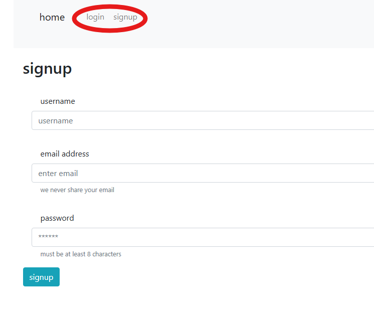
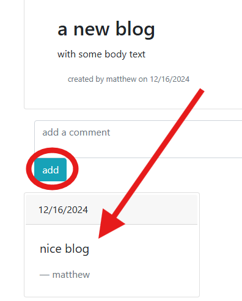
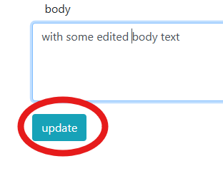
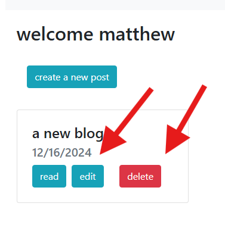

# MVC blog website

  
## Description

This is a website that allows users to post and view blogs on a forum and add comments to those blogs. The technologies used are postgreSQL for the database, and MVC for the front end design and functionality.

## Contents

- [Installation](#installation)
- [Usage](#usage)
- [Credits](#contributing)
- [License](#license)

## Installation

In order to use the application you can navigate to the deployed site on [render](https://musical-funicular-ejr8.onrender.com), or clone the reopositroy and run the server locally on your device.

To run the application locally, you will need to run the commands `npm install` in the root directory, followed by `npm run start` to run node, or `npm run watch` to initiate nodemon.

## Usage

In order to start posting blogs, you will need to create an account, or log in if you have an exisiting one. You are required to enter an email and a password when you sign up. The password must be at least 8 characters long.

You can view blog posts and read them if you are not logged in, but you will not be able to post comments.

Navigate to your dashboard to post a blog. You must be logged in, in order to get to the dashboard.

You view all the blogs you have posted on your dashboard with options to edit or delete the blog or select "read" to view the comments. When a blog post is deleted, it deletes all the comments that were associate with it as well.

## Contributing

This project was coded indepentantly by github user [mcellis1](https://github.com/mcellis1) as a homework assignment for the vanerbilt university coding bootcamp

## License

For more information about licensing, refer to the [license document](./LICENSE)

## Questions

Questions about the project should be directed through the following contacts below.
Link to github profile: [mcellis1](https://github.com/mcellis1)
Email: [matthewcellis98@gmail.com](mailto:matthewcellis98@gmail.com)
